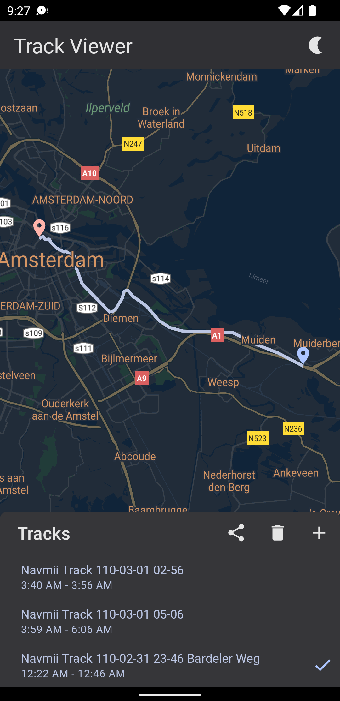

# Track Viewer

### Description
The 'Track Viewer' application is designed for GPX track viewing.

### Features
- Load and display GPX tracks on the map
- Save and delete the latest loaded tracks
- Share with other apps
- Day-Night mode

### Implementation
- Kotlin
- MVVM architecture
- Android Jetpack libraries (Hilt, Room, Compose)
- Google map

